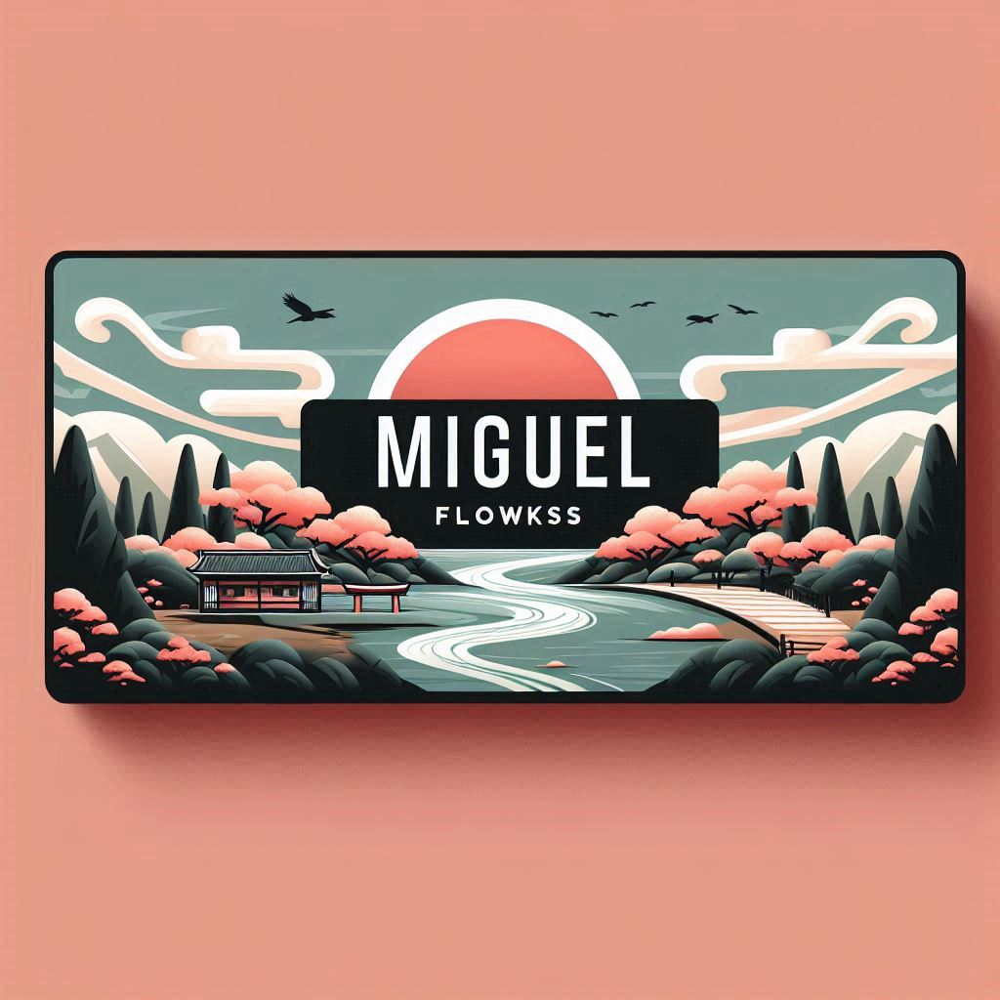

<!--Banner do Flokinho-->

<h1 align="center">Eu me chamoMiguel 👨‍💻</h1>

Sou um programador iniciante.  
Este repositório é minha base de aprendizado, prática e experimentos com código.  
Sinta-se em casa: aqui tem desde tarefa da facul até projetos que tento contribuir.

---

### 💡 Sobre mim
- 📚 Estudante de tecnologia
- 🛠️ Buscando dominar Python, JS e quem sabe um pouco de IA 
- 🎯 Curioso, criativo e viciado em transformar ideia em código
- 🧠 “Se não deu certo, talvez só precise de mais café…”

---

### 🧰 Tecnologias e Ferramentas:

  
  
  
  
  
  

---

### 📈 GitHub Stats

  
  

---

### 🐍 A cobrinha que entrega commits:

---

### 🤙 Me encontra por aí (em breve...)
> *Essa parte pode ter links pro teu LinkedIn, Instagram dev, ou portfólio. Me manda se quiser que eu já coloque aqui.*

---

Curtiu? Posso customizar ainda mais: mudar o tema, colocar frases engraçadas em cada seção, adicionar GIFs ou integrar com seu Notion, por exemplo. Quer algo mais ousado ou diferente? Só mandar!
